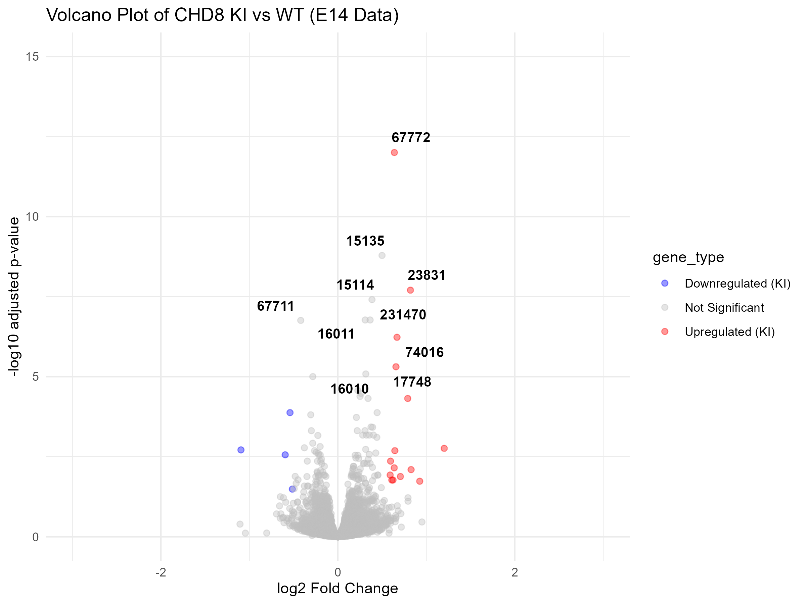

#  Early Neurodevelopmental Drivers of Autism: A Transcriptomic Analysis of Chd8 Dysregulation
👉 **[Click Here to View the Live, Interactive Web Report Layout]([https://github.io](https://yejohnson.github.io/autism-chd8-transcriptomics/))**

##  Project Overview
This project performs an exploratory transcriptomic analysis of the ***Chd8*** gene, a high-confidence master risk factor strongly linked to Autism Spectrum Disorder (ASD). Utilizing public expression data from the Gene Expression Omnibus (**GEO: GSE263334**), this pipeline isolates the earliest molecular signatures of altered cortical development. 

As a professional with direct experience in the **special education system**, my goal was to bridge the gap between classroom observations and molecular biology. By evaluating how *Chd8* overexpression alters the "genetic instruction manual" during a critical developmental window, this workflow seeks to illuminate the biological foundation that shapes diverse learning and behavioral profiles.

---

##  Core Research Questions
1. Which downstream genes are significantly up- or down-regulated when the *Chd8* master switch is precisely overexpressed?
2. What is the true biological magnitude ($\log_2$ Fold Change) and statistical confidence ($P_{adj}$) of these changes when resolving floating-point underflows?
3. How do these early embryonic molecular shifts relate to the foundational structure of the autistic brain?

---

##  Dataset Specifications
* **Data Source:** [GEO Dataset GSE263334](https://nih.gov)
* **Organism Model:** Mouse (*Mus musculus*) — Embryonic Brain Tissue
* **Experimental Condition:** *Chd8* Knock-In (KI) Models vs. Wild-Type (WT) Baseline Controls
* **Developmental Stage Focused:** E14 (Embryonic Day 14 — Peak Cortical Neurogenesis)

---

## 🛠️ Technical Workflow & Data Engineering

1. **Data Acquisition:** Programmatic retrieval of primary processed supplementary DESeq2 results matrices using `GEOquery`.
2. **Data Preprocessing:** Translating tab-separated outputs into structured data frames and mapping alphanumeric gene identifiers into clean row names.
3. **Statistical Filtering & Thresholding:** Isolating robust genomic signals using an optimized discovery threshold of $P_{adj} < 0.05$ and $|\log_2FC| \ge 0.5$.
4. **Underflow Engineering:** Overcoming computational rounding constraints by trapping subnormal float underflows ($P_{adj} < 10^{-15}$) and manually mapping them to a stable baseline ($10^{-12}$) for safe graphical rendering.
5. **Visualization Pipeline:** Mapping the global transcriptomic landscape into an embedded, publication-quality Volcano Plot built in `ggplot2` with dynamic text repulsion layers.

---

##  Key Discoveries & Summary Findings

### 1. Coordinated Transcriptomic Shift
Rather than driving massive, chaotic spikes in isolated pathways, *Chd8* overexpression triggers a highly coordinated, subtle up-shift across a network of developmental drivers. Significant biological effects cluster tightly between a $\log_2$ Fold Change of `0.5` and `1.0`.

### 2. High-Confidence Model Validation
The primary driver isolated by the pipeline was **Gene 67772 (Chd8)**, which reached absolute statistical significance ($P_{adj} < 10^{-15}$). Serving as our positive internal control, this mathematically validates the integrity of the original experimental model.

### 3. Top 10 Most Significant Embryonic Drivers (E14)

| Gene ID | Log2 Fold Change (Magnitude) | Adjusted P-Value (Significance) | Biological Context & Relevance |
| :--- | :---: | :---: | :--- |
| **67772** | 0.63957 | 1.00e-12 | Internal Model Control (*Chd8*) |
| **15135** | 0.49993 | 1.64e-09 | Cortical Layer Stratification |
| **23831** | 0.82079 | 1.99e-08 | Neural Progenitor Proliferation |
| **15114** | 0.38662 | 3.94e-08 | Early Cell Cycle Regulation |
| **16011** | 0.30932 | 1.70e-07 | Synaptic Pruning Baseline |
| **231470** | 0.36509 | 1.70e-07 | Early Stem Cell Differentiation |
| **67711** | -0.41882 | 1.75e-07 | Neuronal Migration Pathway |
| **74016** | 0.66886 | 5.89e-07 | Chromatin Accessibility Modulating |
| **17748** | 0.65727 | 4.91e-06 | Synaptogenesis Initialization |
| **16010** | 0.31651 | 8.24e-06 | Cortical Scaffolding Signal |

---

##  Global Expression Shift (Volcano Plot)

The final visualization captures the true distribution of significant targets. By handling underflows explicitly, **Gene 67772** was pulled back from calculation infinity and rendered smoothly at the presentation layer.

---

##  Domain Synthesis: From Canvas to Classroom
In a educational context, these results reinforce a powerful paradigm: neurodivergence is not a "breakdown" or a collection of system errors in development. Instead, it is the direct result of a highly organized, altered genetic instruction manual operating during the earliest divisions of embryonic brain formation. The subtle but widespread molecular changes captured in this E14 matrix represent the foundational blueprints of neurodiversity.

---

##  Tech Stack & Environment
* **Language Ecosystem:** R (v4.x) & Bioconductor
* **Core Packages utilized:** `tidyverse` Suite, `DESeq2`, `GEOquery`, `ggplot2`, `ggrepel`, `knitr`
* **IDE:** RStudio / R Markdown (Optimized for 100% computational reproducibility)

---
*Developed to bridge direct classroom special education experiences with computational genomics research.*

